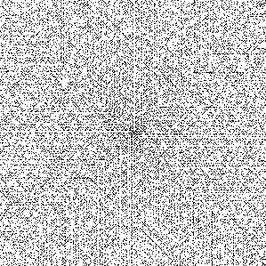

# ulam-spiral
Example code for creating an Ulam spiral with python. Necessary python packages are *numpy* and *png*. 

You can create an Ulam spiral object with the constructor: 

    UlamSpiral(size, spin, start, incrementNumber)

+ `size` describes the length of the quadratic grid. The size must be an odd number because the grid must have a center point. 
+ `spin` represents the direction of filling the grid from center point:
  - 0 = down right
  - 1 = right up
  - 2 = up left
  - 3 = left down 
  - 4 = down left
  - 5 = left up
  - 6 = up right
  - 7 = right down

+ `start` is the integer > 0 in the center point
+ `incrementNumber` is an integer > 0 which describes the amount added to the current number after every step

## Example

How to use:

    from ulam import *

    # UlamSpiral(size, spin, start, incrementNumber)
    ulam = UlamSpiral(299,1,1,2)
    ulam.fillGrid()
    ulam.paint()

This example writes a png file ulam_299_1_1_2 where black pixels denotes a prime. The size of the spiral is 299x299. The spin is counterclockwise going first step up. It starts with number 1 in the center point which increments with 2 in every step. The output is the following picture:

